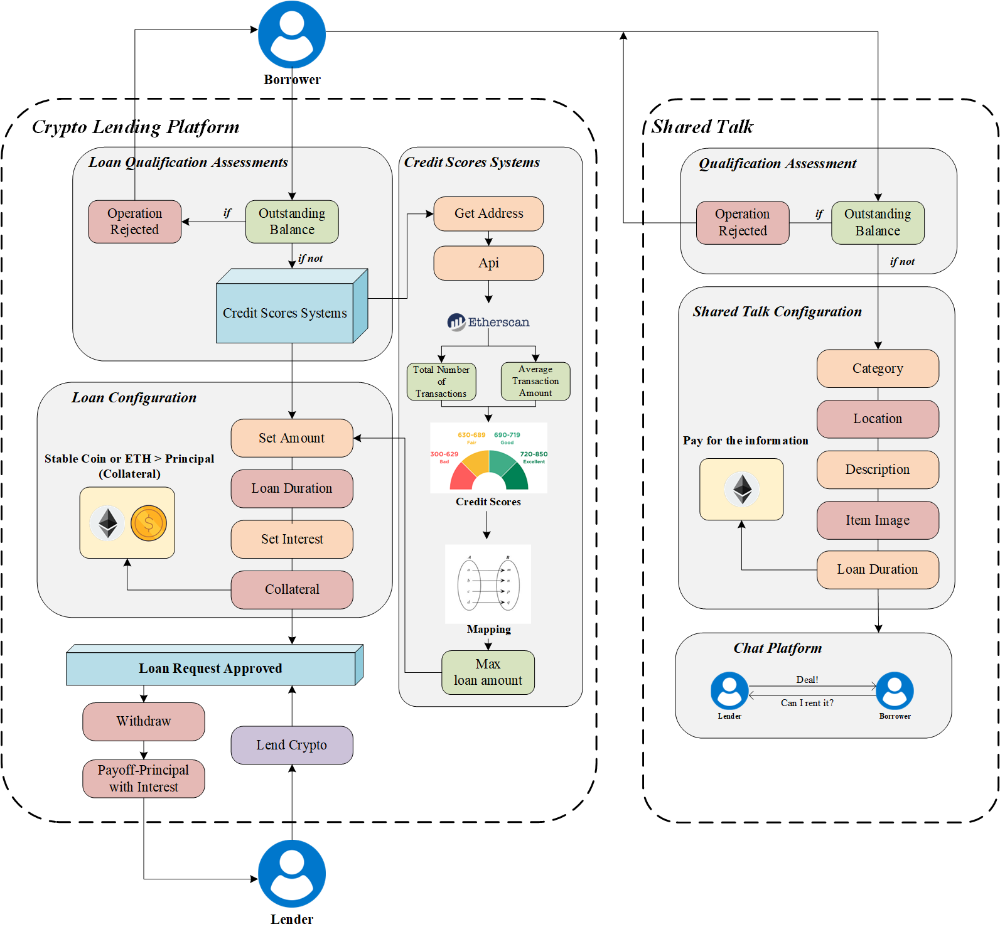
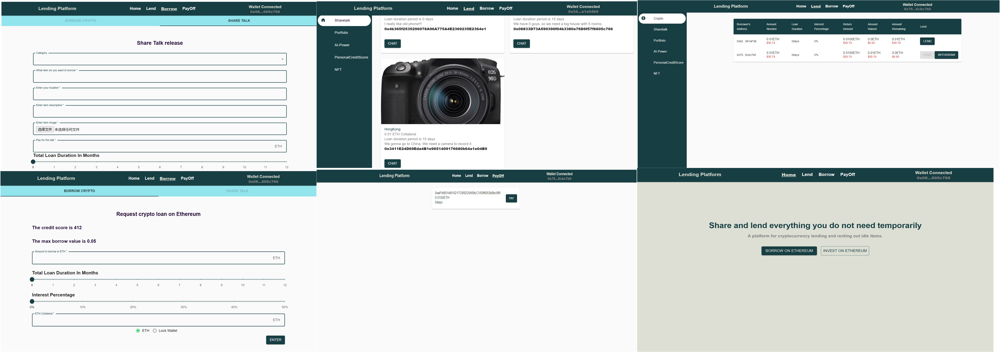

## Tech Stack / Tooling

- JavaScript (React JS)
- Redux Toolkit
- Material UI
- Blockchain Technologies:
  - Hardhat
  - Solidity
  - ChainLink
  - IPFS


## DApp Process Flow




## User Interface




## Project Scripts

In the project directory, you can execute the following commands:

### First step:

In the terminal directory `./FTGP23_Group5_05`, run:

```bash
npm start


This command runs the app in development mode. Open (https://ftgp-23-group5-05.vercel.app/) to view it in your browser. The page will automatically reload if you make changes. You might also see lint errors in the console.

Before starting, ensure that the `.env` file is added in the `defilendingdappbackend` directory with the keys `ALCHEMY_API_KEY_URL` and `SEPOLIA_PRIVATE_KEY`.

### Second step:
In the terminal directory `FTGP23_Group5_05/defilendingdappbackend`, run:

```bash
npx hardhat compile

This command compiles the Solidity code.

### Third step:
In the terminal directory `FTGP23_Group5_05/defilendingdappbackend`, run:

```bash
npx hardhat run scripts/deploy.js --network sepolia

This command deploys the smart contract to the Sepolia Test Network.

### Fourth step:
After deployment, copy the contract address and ABI (update the ABI in `src/constants/index.js` only if the contract has changed).

## Important Points
1. Create a `.env` file in `defilendingdappbackend` to store your private key and Alchemy API key URL.
2. Ensure your ABI file and deployed smart contract address are correctly referenced in the `src/constants/index.js` file on the frontend.

